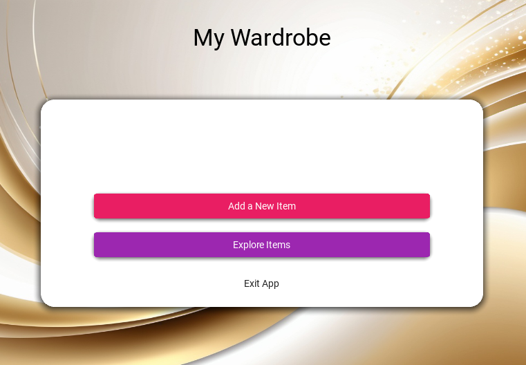
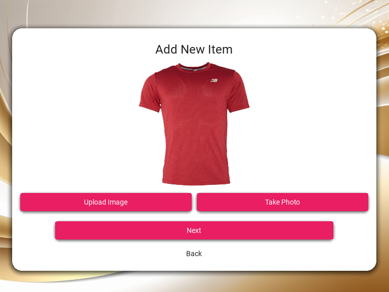

# My Wardrobe 

[](https://www.python.org/downloads/)
[](https://kivymd.readthedocs.io/)

**My Wardrobe** is a modern, intuitive desktop application for organizing and managing your clothing collection. Built with Python and KivyMD, it provides a beautiful Material Design interface for cataloging your wardrobe with photos and smart tagging capabilities.


## ✨ Features

### 🔍 **Smart Wardrobe Management**
- **Photo Capture**: Take photos directly through your camera or import existing images
- **Intelligent Tagging**: Comprehensive tagging system with predefined categories:
  - **Clothing Types**: T-shirts, Dresses, Pants, Shoes, Accessories, and more
  - **Attributes**: Material, color, brand, style, season
  - **Custom Tags**: Add your own personalized tags
- **Search**: Find items quickly using tag-based filtering
- **Visual Catalog**: Browse your wardrobe with thumbnail previews

### 🎨 **User Experience**
- **Material Design UI**: Clean, modern interface following Material Design principles
- **Responsive Layout**: Optimized for desktop use with intuitive navigation
- **Dark/Light Theme**: Supports both light and dark themes
- **Cross-Platform**: Works on Windows, macOS, and Linux

### 🗂️ **Data Management**
- **Local Storage**: All data stored locally on your device
- **JSON Database**: Lightweight, portable data format
- **Photo Organization**: Automatic photo management and organization
- **Backup Ready**: Easy to backup and transfer your wardrobe data

## 🚀 Quick Start

### Prerequisites

- **Python 3.7 or higher**
- **Webcam** (optional, for photo capture)
- **Windows, macOS, or Linux**

## 📸 Screenshots




### Installation

#### Option 1: Automated Installation (Windows)

1. **Clone the repository**:
   ```bash
   git clone https://github.com/WrackerTony/My-wardrobe.git
   cd My-wardrobe
   ```

2. **Run the installation script**:
   ```bash
   install_requirements.bat
   ```

3. **Launch the application**:
   ```bash
   python main.py
   ```


## 📱 How to Use

### Adding New Items

1. **Launch the application** and click "Add a New Item"
2. **Choose your method**:
   - **Camera**: Take a photo directly through the app
   - **File**: Import an existing image from your device
3. **Tag your item**:
   - Select clothing type from the dropdown
   - Add custom tags (color, brand, material, etc.)
   - Use comma-separated values for multiple tags
4. **Save** your item to the catalog

### Searching Your Wardrobe

1. **Click "Search Items"** from the main menu
2. **Enter search terms**:
   - Use tag names to filter results
   - Combine multiple tags for precise searches
3. **Browse results** with photo thumbnails and tag information

### Managing Items

- **View Details**: Click on any item to see full-size photo and all tags
- **Delete Items**: Remove items permanently from your wardrobe
- **Edit Tags**: Update or add new tags to existing items

## 🛠️ Technical Details

### Architecture

```
My-wardrobe/
├── main.py              # Main application entry point
├── Foto_save.py         # Photo capture and storage management
├── Foto_tags.py         # Tag management and search functionality
├── requirements.txt     # Python dependencies
├── install_requirements.bat  # Windows installation script
├── Backround_1.png      # Application background image
├── photos/              # Auto-created: Stores captured photos
└── data/                # Auto-created: Stores tags and metadata
```

### Dependencies

| Package | Purpose | Version |
|---------|---------|---------|
| **KivyMD** | Material Design UI framework | Latest |
| **Kivy** | Cross-platform GUI framework | Latest |
| **OpenCV** | Image processing and camera capture | Latest |
| **Plyer** | Platform-specific features | Latest |

### Data Storage

- **Photos**: Stored in `photos/` directory as PNG files
- **Tags**: Stored in `data/photo_tags.json` as JSON
- **Metadata**: Photo IDs tracked in `photos/photo_id.txt`


## 📄 License

**🚫 ABSOLUTELY NO COPYING ALLOWED 🚫**

**All Rights Reserved - Copyright © 2025 [Your Name]**

⚠️ **WARNING: This code is protected by copyright law. Unauthorized copying is ILLEGAL and will be prosecuted.**

This software and its source code are proprietary and confidential. **NO PART** of this software may be reproduced, copied, distributed, or transmitted in any form or by any means without explicit written permission from the copyright owner.

**🔒 ZERO-TOLERANCE COPYING POLICY:**
- ❌ **NO COPYING** - Not even a single line of code
- ❌ **NO REPRODUCTION** - In any form or format  
- ❌ **NO MODIFICATION** - Or creating derivative works
- ❌ **NO DISTRIBUTION** - Sharing is strictly forbidden
- ❌ **NO REVERSE ENGINEERING** - Or decompiling
- ❌ **NO COMMERCIAL USE** - Without written permission
- ❌ **NO CLAIMING OWNERSHIP** - This code belongs to [Your Name]
- ❌ **NO SIMILAR PROJECTS** - Based on viewing this code

**⚖️ LEGAL CONSEQUENCES:**
Violators will face immediate legal action including copyright infringement lawsuits, monetary damages, and prosecution to the full extent of the law.

**✅ What you CAN do:**
- Use the compiled application for personal purposes
- View the code for educational learning (NO COPYING)
- Report bugs and suggest improvements


<div align="center">

**Made with ❤️ for fashion enthusiasts and organization lovers**

[⭐ Star this project](https://github.com/yourusername/My-wardrobe) if you find it useful!

</div>

